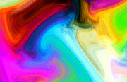

# Klk's Simple Plasma for macOS

A modern Apple Silicon and Intel port of **klk's Simple Plasma**. The original
Shadertoy algorithm is rendered by SpriteKit inside a native macOS `.saver`
bundle; the old Vuo and OpenGL runtimes are not required. It supports macOS 13
or later and has been tested on macOS 27.



## Download

Download the package for your Mac from the
[latest release](https://github.com/niu541412/KlkSimplePlasma/releases/latest):

- `arm64` for Apple Silicon Macs
- `x86_64` for Intel Macs

Unzip the archive and double-click `Klk's Simple Plasma.saver` to install it.
Since release builds are ad-hoc signed, macOS may quarantine a downloaded copy.
If necessary, remove quarantine before installing:

```sh
xattr -dr com.apple.quarantine "Klk's Simple Plasma.saver"
```

## Building

Building requires Xcode or the Xcode Command Line Tools with a macOS SDK:

```sh
./scripts/build.sh arm64
./scripts/build.sh x86_64
```

Build products are written beneath `build/<architecture>/`. GitHub Actions
builds both architectures independently and attaches both ZIP files to tagged
releases.

The preview is a checked-in, multi-representation `thumbnail.tiff` containing
90×58 (1x) and 180×116 (2x) images. It is copied without modification, so its
contents are identical across architectures and builds.

## Credits and license

- Original shader by [klk on Shadertoy](https://www.shadertoy.com/view/XsVSzW)
- Original Vuo port shared in the [Vuo Community](https://community.vuo.org/t/shadertoy-shaders-to-screensavers-suggestions/6211)
- Native macOS port and packaging by niu541412

This project is distributed under
[CC BY-NC-SA 3.0](https://creativecommons.org/licenses/by-nc-sa/3.0/).
